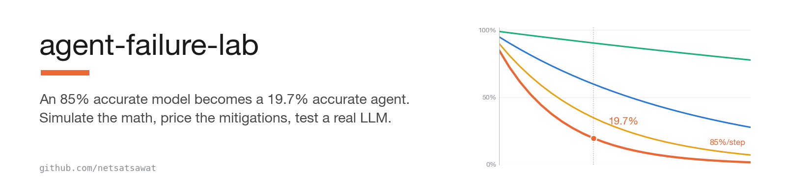
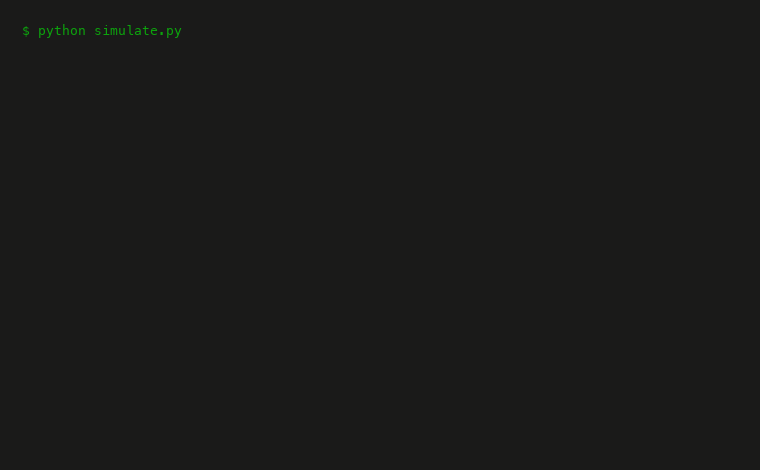
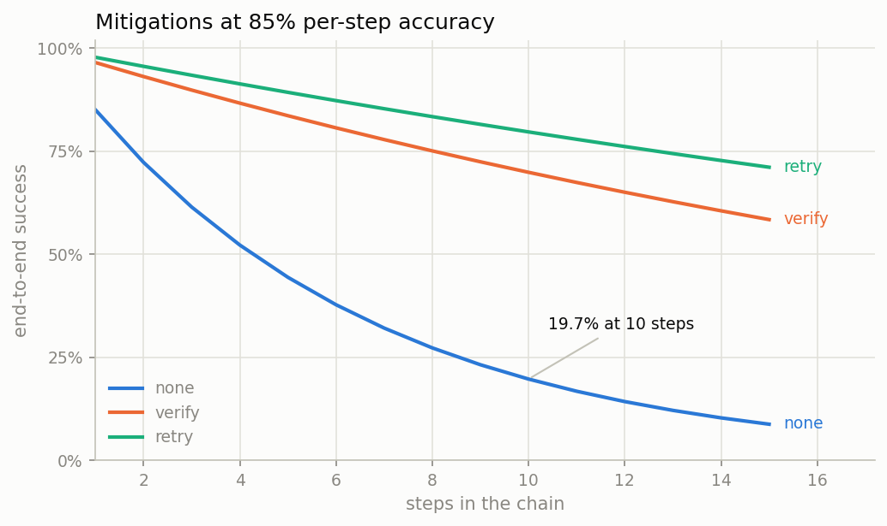

<h1 align="center">
  <picture>
    <source media="(prefers-color-scheme: dark)" srcset="assets/banner-dark.png">
    
  </picture>
</h1>

<p align="center">
  <a href="#-feel-the-math-no-model-needed">Feel the math</a>&nbsp;&nbsp;·&nbsp;&nbsp;<a href="#-prove-it-on-a-real-model">Prove it on a real model</a>&nbsp;&nbsp;·&nbsp;&nbsp;<a href="https://netsatsawat.github.io/agent-failure-lab/">Live calculator</a>&nbsp;&nbsp;·&nbsp;&nbsp;<a href="https://www.amazon.com/dp/B0H17XQ9SY">The book</a>
</p>

<p align="center">
  <a href="LICENSE"></a>
  <a href="https://www.python.org/"></a>
  
  
  <a href="https://netsatsawat.github.io/agent-failure-lab/"></a>
  <a href="https://satsawat.ai"></a>
</p>

> Watch compound error kill your AI agent. Then watch the mitigations save it.

Chain 10 steps at 85% per-step accuracy and your end-to-end success rate is
**19.7%**. Every AI leader nods at that sentence. Almost nobody feels it.
This lab makes the math runnable and visual, and since arithmetic alone never
convinced a skeptic, it also reproduces the collapse with a real agent on a
real local model, logging and classifying every failure along the way.

Companion code for the book [*Why Your AI Agent Will
Fail*](https://www.amazon.com/dp/B0H17XQ9SY) and the writing at
[satsawat.ai](https://satsawat.ai).



## 🧭 Why this repo exists

Multi-step agents are how AI ships now: extract, look up, transform, decide,
summarize. Each step is one model call, and each call is right most of the
time. That is the trap: per-step accuracy compounds against you. A 3-step
demo that works three times out of five is enough to green-light a project.
The same quality spread over 10 production steps is a 1-in-5 long shot.
Worse, most of those failures are not crashes. They are confidently wrong
answers, so your logs stay green while your users lose trust.

The escape is not "wait for a better model." It is architecture. The two
standard mitigations have very different economics, and one question decides
which applies: can code detect the failure? Schema violations and tool
errors are free to catch and cheap to retry. Hallucinations and subtle
arithmetic slips need an LLM verifier, which costs a call per step and has
imperfect recall.

This lab lets you hold the whole argument in your hands. Simulate it, drag
sliders on it, then run a real 8-step agent on a real local model and watch
the failure taxonomy come out: what the verifier catches, what it costs, and
what it misses.

## 🧮 Feel the math (no model needed)

**1. Zero-install CLI** (stdlib only, Python 3.9 or newer): `python simulate.py`

**2. The notebook.** The full walkthrough: the arithmetic, Monte Carlo
agreement, mitigation curves, the cost of reliability, and the
reliability-budget table. Executed outputs are embedded, so it renders
complete on GitHub:

```
python -m venv .venv && source .venv/bin/activate
pip install -r requirements.txt
jupyter notebook notebook/compound_failure_walkthrough.ipynb
```

**3. The Streamlit app:** `streamlit run app.py`

**4. The web calculator.** A zero-dependency single file in
[`docs/index.html`](docs/index.html), deployable straight to GitHub Pages
(Settings, then Pages, deploy from `/docs`). Light and dark mode, hover
tooltips.

The analytic model in one paragraph. With `none`, failures go undetected.
With `retry`, code-detectable failures get one free retry. With `verify`, an
LLM verifier reviews each step at the cost of one extra call, and a caught
failure gets one corrected attempt. At 10 steps, retry buys more reliability
than verify for half the calls, provided the failure is detectable by code.
Real agents need both, applied per step type. Two deliberately generous
assumptions sit inside the analytic verify curve: the verifier never
false-flags correct work, and a corrected attempt succeeds at the base rate.
Real mode measures the recall assumption empirically.



## 🔬 Prove it on a real model

Real mode runs an 8-step expense-report agent (extract dates, extract items,
categorize, request exchange rates via a tool, convert, sum, policy check,
final summary) against a local model, on synthetic documents whose correct
answers are known exactly. Every step attempt is classified:

- `format_error`: unparseable or malformed output (code-detectable)
- `tool_error`: wrong or missing tool call (code-detectable)
- `wrong_value`: well-formed but factually wrong, the hallucination class
- `infra_error`: transport or runtime failure, reported separately so
  infrastructure problems never masquerade as model failures

### The documents, and how grading works

Documents are generated, not collected, and that is what makes automatic
grading possible. `python realmode.py show-doc` prints any of them:

```
EXPENSE REIMBURSEMENT REQUEST
Submitted by: Farid Rahman
Trip period: January 01, 2026 to January 07, 2026

Expenses claimed:
  - Whiteboard markers and notepads .... €81.16
  - Team dinner at riverside restaurant .... EUR 77.91
  - Taxi from airport .... THB 640.00
  - Baggage fee for equipment .... €23.89
  - Hotel room - 2 nights .... EUR 304.46

Please process according to company travel policy.
Reference: TRIP-0001

--- ground truth (what the agent is graded against) ---
trip: 2026-01-01 to 2026-01-07 · 5 claimable items
  Taxi from airport: 640.0 THB = 17.92 USD (transport)   ...
grand total: 544.33 USD · flags: none
```

Generation is seeded and deterministic (same `--seed`, same documents), with
varied date formats, currency symbols, and mixed THB/EUR/USD amounts. The
`--hard` flag adds scan-noise lines, shuffled items, a VOIDED line that must
be excluded, and a printed "Total claimed" that is wrong, as bait for any
agent that copies instead of computing. None of it changes the ground truth.

The full experimental design lives in [METHODOLOGY.md](METHODOLOGY.md):
research questions, variables, grading protocol, tolerances, harness
validation, and threats to validity. The short version is that grading
happens at three layers:

1. **Per step, against conditional truth.** Each step is judged against the
   correct answer given the agent's own prior outputs. A step is never
   blamed for errors it inherited, so the taxonomy isolates each step's real
   skill. Wrong values still propagate downstream, exactly as in production.
2. **End to end, against absolute truth.** The final summary must match the
   document's actual dates, total, and policy flags. This is the number that
   compounds.
3. **The harness itself is tested.** A deterministic oracle mock replays the
   whole pipeline with known-perfect (or corrupted) answers.
   `python tests/test_realmode.py` runs 12 tests covering the classifier,
   both mitigations, the traps, the fairness guarantees (decoys cannot
   collide with real items, decoy items still have true categories, and
   duplicates are caught), and the infrastructure-failure accounting: a
   document whose chain hit a transport error is excluded from the per-step
   rates as well as the end-to-end one. The blind verifier never sees
   ground truth.

### Reproduce it from scratch

1. **Python side** (any machine): `python -m venv .venv && source
   .venv/bin/activate && pip install -r requirements.txt`. The simulator and
   the test suite need no model. `python simulate.py`,
   `python tests/test_realmode.py`, and
   `python realmode.py run --mock --docs 3` all run dry.
2. **Deploy the local LLM.** Install [Ollama](https://ollama.com/download)
   (macOS and Windows installers; on Linux,
   `curl -fsSL https://ollama.com/install.sh | sh`), then pull a model:
   `ollama pull qwen3.6:27b` is the tag used for the shipped results, a
   roughly 17 GB download that wants Apple Silicon or a serious GPU. Any
   model from the [Ollama library](https://ollama.com/library) works via
   `--model`. Smaller models run on modest hardware and fail more often,
   which is the point of the lab. Confirm it is serving with `ollama list`
   (the API listens on `localhost:11434`).
3. **Run the experiments:**

```
python realmode.py run --docs 8 --model qwen3.6:27b        # baseline
python realmode.py run --docs 8 --mitigation retry         # free retry on code-detectable failures
python realmode.py run --docs 8 --mitigation verify        # blind LLM verifier per step
python realmode.py run --docs 8 --hard                     # adversarial documents
```

4. **Read the results.** Each run streams
   `runs/<model>_<mitigation>[_hard].jsonl` and writes a markdown report plus
   a per-step failure-taxonomy chart alongside it. Rebuild any report with
   `python realmode.py report runs/<file>.jsonl`, and inspect any document
   with `python realmode.py show-doc [--doc-id N] [--hard]`.

### Results (qwen3.6:27b, temp 0.2, 8 docs × 8 steps)

| run | per-step success | end-to-end | what happened |
|---|---|---|---|
| clean documents | 63/64 (98.4%) | **88%** | the one failure: `sum_categories` summed to 669.03 instead of 670.03. A $1 arithmetic slip, class `wrong_value`, invisible to retry |
| hard documents | 64/64 | **100%** | the model beats the noise, the VOIDED decoy, and the wrong-total bait. At roughly 99% per step, a fully clean run at N=8 is expected variance |
| clean + `verify` | 63/64 (98.4%) | **88%** | the blind verifier flagged 9 of 64 steps, all extraction or arithmetic, including the baseline's failing doc and step (its retry fixed it). It also checked and missed a 6-cent conversion error, so end-to-end did not move while call count roughly doubled |

Observed end-to-end was consistent with the compound-math prediction from
measured per-step rates in every run. At 8 documents this is a demonstration
that the pipeline and the math connect, not a benchmark; larger-N and
cross-model runs are under What's next. The verify run carries the sharpest
lesson: an LLM verifier's value hinges on recall against subtle errors, and
the error it missed was six cents. That is precisely the class the analytic
model says you are paying it to catch. Full logs, reports, and charts in
`runs/`.

## 🗂️ Repo layout

```
METHODOLOGY.md             experimental design, grading protocol, threats to validity
failure_lab/model.py       the analytic + Monte Carlo model (single source of truth)
failure_lab/charts.py      shared matplotlib layer (notebook, app, README charts)
failure_lab/realmode/      real mode: documents, agent steps, LLM clients, report
simulate.py                stdlib-only simulation CLI
realmode.py                real-mode CLI (Ollama or oracle mock)
tests/test_realmode.py     deterministic real-mode tests (no model needed)
notebook/                  executed walkthrough (charts embedded, renders on GitHub)
app.py                     Streamlit app
docs/index.html            standalone web calculator (GitHub Pages ready)
runs/                      real-mode results: a JSONL log, markdown report, and taxonomy chart per run
scripts/                   generators: charts, notebook, README GIF
```

## 🔭 What's next

Each item below is an open question the current results raise but cannot
answer at N=8. In rough priority order:

- **Larger N.** Run 50 to 100 documents per condition so the end-to-end rates
  carry real confidence intervals. The interesting question is whether
  observed end-to-end stays glued to the independence prediction
  (`p_eff^n`) or drifts below it, which would mean failures correlate:
  documents that trip one step tend to trip others. Production incident data
  suggests they do; this harness can measure it.
- **Cross-model runs.** Same seed, same documents, different `--model` tags.
  The lab's own thesis predicts smaller models shift the taxonomy toward
  `format_error` while big models fail quietly as `wrong_value`. If that
  holds, it has a practical consequence: small-model failures are the cheap,
  code-detectable kind, so a small model plus `retry` may beat a large bare
  model on cost per successful chain. That claim is testable here in an
  afternoon.
- **Verifier precision and recall by error size.** Runs now log attempt-level
  outcomes, so the false-flag rate of the verifier is measurable directly.
  The complement is a recall sweep: inject `wrong_value` corruptions of
  controlled magnitude (one cent, one dollar, ten percent) and chart verifier
  catch rate against error size. The shipped run's 6-cent miss suggests
  recall falls off exactly where you need it most. A related variant worth
  testing: use a different model as verifier, since self-verification may
  share the worker's blind spots.
- **More mitigations from real deployments.** Three candidates, in order of
  interest: constrained decoding (turn `format: json` on and measure how much
  of the format class it removes, and whether forcing grammar hurts value
  accuracy); step fusion (merge the 8 steps into 4, trading per-call
  complexity against chain length, which is the architecture lever the book
  argues for); and majority vote on the arithmetic steps, where the observed
  failures live.
- **`agent-report-card` integration.** The run JSONL is already a structured
  trace: step, outcome, attempts, verifier verdicts, latency. The plan is to
  make that a stable format a standalone eval harness can score and diff, so
  a CI job can fail a build when an agent's report card regresses between
  versions.
- **Real-document mode.** The honest gap in this lab is that even hard mode is
  cleaner than production paperwork. Synthetic documents are what make
  exact grading possible, so bring-your-own-documents needs a labeling story
  first: likely a helper that drafts ground truth for your documents and has
  you confirm it once, after which the same grading protocol applies.

Runs on other models with the same seed are especially welcome as issues or
PRs, since cross-model comparison is where a single machine runs out of
road.

---

Written by [Satsawat Natakarnkitkul](https://satsawat.ai), a data & AI leader
in ASEAN and the author of *Why Your AI Agent Will Fail*. Newsletter:
[AI in Practice](https://satsawat.ai/#newsletter)

License: MIT
