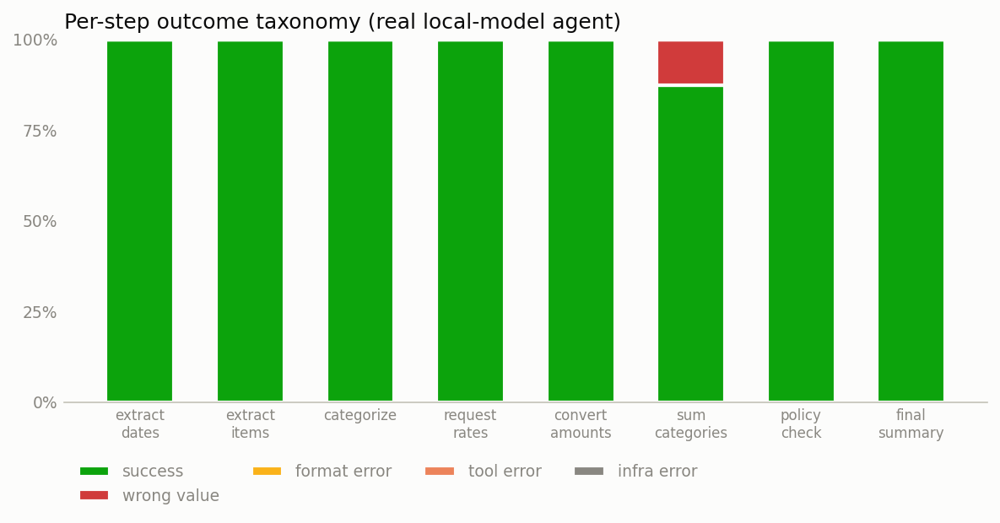

# Real-mode report

Model: **qwen3.6-27b** · documents: **8** · mitigation: **none** · steps retried: 0

| step | success | wrong value | format error | tool error | infra error |
|---|---|---|---|---|---|
| extract_dates | 100% | 0% | 0% | 0% | 0% |
| extract_items | 100% | 0% | 0% | 0% | 0% |
| categorize | 100% | 0% | 0% | 0% | 0% |
| request_rates | 100% | 0% | 0% | 0% | 0% |
| convert_amounts | 100% | 0% | 0% | 0% | 0% |
| sum_categories | 88% | 12% | 0% | 0% | 0% |
| policy_check | 100% | 0% | 0% | 0% | 0% |
| final_summary | 100% | 0% | 0% | 0% | 0% |

**Observed end-to-end success: 88%** · predicted from measured per-step rates (independence assumption): 88%

Per-step outcomes are judged against *conditional* ground truth (correct given the agent's own prior outputs); end-to-end is judged against absolute ground truth. `format_error` and `tool_error` are code-detectable, so the `retry` mitigation applies. `wrong_value` is the hallucination class: only a verifier or ground truth catches it.
